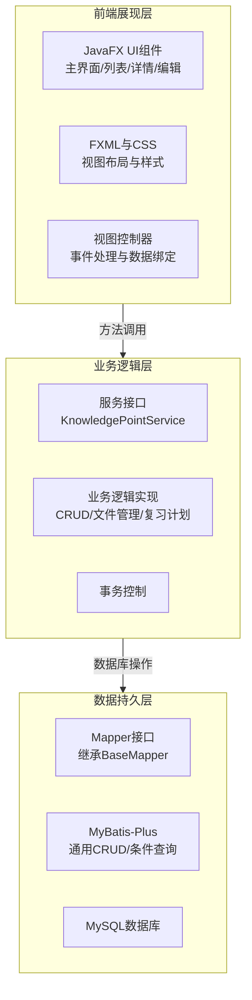

基于你的技术栈选择（Java、MyBatis-Plus、MySQL、Java原生前端），下面为你设计一个清晰可行的项目方案。其核心架构和关键工作流程，可以借助下图一览：



### 📊 核心数据模型设计
这是项目的基础，围绕“知识点”实体展开。

| 实体对象 | 核心属性说明 |
| :--- | :--- |
| **知识点** | 核心信息：`id`, `title`, `description`, `tags`（分类标签）, `category`（主分类）<br>时间信息：`createTime`, `updateTime`<br>复习信息：`reviewCount`（复习次数）, `nextReviewDate`（下次复习日期）, `difficultyLevel`（难度）, `isRemembered`（是否掌握） |
| **资料附件** | `id`, `knowledgeId`（关联知识点ID）, `fileName`, `filePath`（本地存储路径）, `fileType`（文字、图片、音频、视频）, `fileSize`, `uploadTime` |
| **复习记录** | `id`, `knowledgeId`, `reviewTime`（复习时间）, `reviewResult`（复习结果）, `durationSeconds`（复习耗时） |

### ⚙️ 关键配置与特性
利用MyBatis-Plus的强大功能简化开发：

*   **简化CRUD**：让你的Mapper接口继承MyBatis-Plus的`BaseMapper`接口，即可直接获得单表几乎所有的CRUD操作方法，无需编写XML文件。
*   **条件构造器**：使用`QueryWrapper`或`LambdaQueryWrapper`可以方便地构建动态查询条件，实现多条件组合查询。
*   **自动填充**：配置`MetaObjectHandler`，在插入或更新数据时自动填充字段，如自动设置`createTime`和`updateTime`。
*   **逻辑删除**：使用`@TableLogic`注解实现逻辑删除，删除的数据不会被真正移除，便于恢复。
*   **YAML配置示例**：
    ```yaml
    mybatis-plus:
      mapper-locations: classpath:/mapper/*.xml
      type-aliases-package: com.yourcompany.knowledge.model.entity
      global-config:
        db-config:
          id-type: auto
          logic-delete-field: deleted
      configuration:
        map-underscore-to-camel-case: true
        log-impl: org.apache.ibatis.logging.stdout.StdOutImpl
    ```

### 🗂️ 本地文件存储策略
针对多媒体资料，建议采用本地文件系统存储方案：
*   **存储路径**：在项目目录或用户目录下创建专用文件夹（如`./data/files/`），并按类型（`image/`, `audio/`, `video/`）分子目录。
*   **数据库关联**：在数据库中，附件表只保存文件的原始名称和存储路径。当需要展示或播放时，通过路径加载文件。

### 🚀 开发阶段规划
建议将开发过程分为四个清晰的阶段，由简到繁，逐步实现功能。

| 阶段 | 核心目标 | 交付成果 |
| :--- | :--- | :--- |
| **第一阶段：基础框架搭建** | 搭建可运行的项目骨架，打通从界面到数据库的完整链路。 | 1. 完成项目创建和依赖配置。<br>2. 完成数据库表结构创建。<br>3. 实现一个最简单的知识点新增和查看界面。 |
| **第二阶段：核心功能实现** | 完善知识点的全生命周期管理和附件的上传下载。 | 1. 完成知识点的增、删、改、查、条件查询功能。<br>2. 实现多媒体资料的上传、存储和关联展示。 |
| **第三阶段：复习计划集成** | 引入复习逻辑，使软件真正为“复习”服务。 | 1. 实现基于算法的下次复习日期计算。<br>2. 添加复习记录功能。<br>3. 提供“今日待复习”列表。 |
| **第四阶段：界面优化与增强** | 提升用户体验，并增加数据统计等增值功能。 | 1. 优化UI界面和交互体验。<br>2. 增加简单的数据统计图表。<br>3. 实现数据导出备份功能。 |

希望这个不涉及具体代码的设计方案能帮助你清晰地规划开发工作。如果你对某个设计细节有进一步的疑问，我们可以继续讨论。